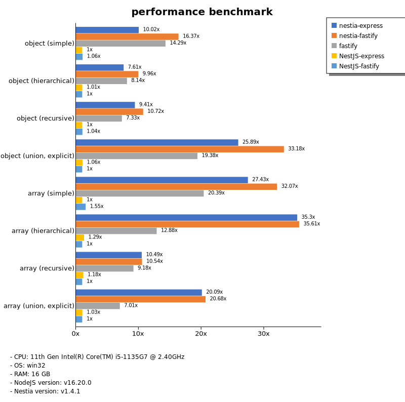

# Benchmark of `nestia`
> - CPU: 11th Gen Intel(R) Core(TM) i5-1135G7 @ 2.40GHz
> - Memory: 16,218 MB
> - OS: win32
> - NodeJS version: v16.20.0
> - Nestia version: v1.3.8

## assert

 Types | nestia-express | nestia-fastify | NestJS-express | NestJS-fastify | fastify 
-------|------|------|------|------|------
 object (simple) | 38 | 54 | 3.59 | 3.80 | 39 
 object (hierarchical) | 82 | 91 | 5.70 | 7.27 | 86 
 object (recursive) | 105 | 103 | 6.58 | 6.50 | 98 
 object (union, explicit) | 69 | 71 | 2.90 | 2.48 | 59 
 array (simple) | 109 | 108 | 7.05 | 6.99 | 104 
 array (hierarchical) | 112 | 107 | 5.97 | 5.61 | 105 
 array (recursive) | 108 | 100 | 5.58 | 5.40 | 80 
 array (union, explicit) | 124 | 114 | 6.16 | 5.81 | 117 

> Unit: Megabytes/sec

## stringify

 Types | nestia-express | nestia-fastify | NestJS-express | NestJS-fastify | fastify 
-------|------|------|------|------|------
 object (simple) | 63 | 133 | 8.42 | 7.99 | 2.46 
 object (hierarchical) | 146 | 161 | 14 | 17 | 2.09 
 object (recursive) | 154 | 206 | 14 | 15 | 2.27 
 object (union, explicit) | 109 | 129 | 7.13 | 7.27 | 2.41 
 array (simple) | 108 | 129 | 15 | 15 | 2.35 
 array (hierarchical) | 154 | 160 | 13 | 13 | 2.45 
 array (recursive) | 135 | 142 | 14 | 14 | 2.30 
 array (union, explicit) | 119 | 131 | 15 | 16 | 2.39 

> Unit: Megabytes/sec

## performance

 Types | nestia-express | nestia-fastify | NestJS-express | NestJS-fastify | fastify 
-------|------|------|------|------|------
 object (simple) | 66 | 102 | 7.61 | 8.31 | 46 
 object (hierarchical) | 139 | 157 | 16 | 17 | 98 
 object (recursive) | 131 | 155 | 14 | 14 | 102 
 object (union, explicit) | 82 | 98 | 3.00 | 3.09 | 63 
 array (simple) | 109 | 124 | 7.11 | 7.33 | 96 
 array (hierarchical) | 125 | 129 | 6.02 | 5.94 | 104 
 array (recursive) | 117 | 123 | 12 | 12 | 96 
 array (union, explicit) | 121 | 126 | 6.23 | 6.09 | 113 

> Unit: Megabytes/sec

Total elapsed time: 1,380,000 ms
