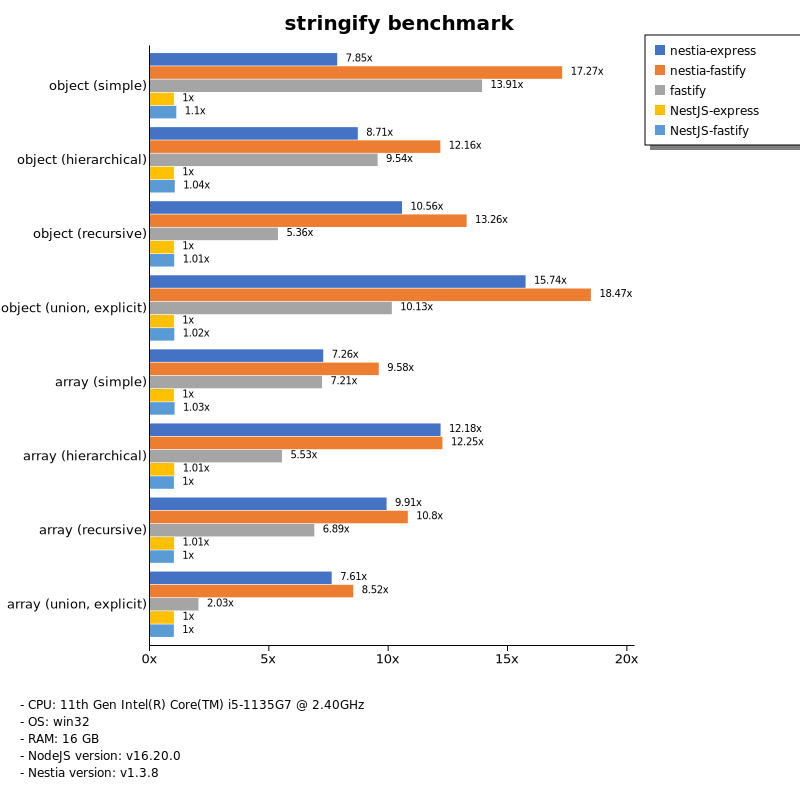

# Benchmark of `nestia`
> - CPU: 11th Gen Intel(R) Core(TM) i5-1135G7 @ 2.40GHz
> - Memory: 16,218 MB
> - OS: win32
> - NodeJS version: v16.20.0
> - Nestia version: v0.1.0

## stringify

 Types | express-nestia | express-nestjs | express-pure | fastify-nestia | fastify-nestjs | fastify-pure 
-------|------|------|------|------|------|------
 object (simple) | 56 | 7.93 | 48 | 135 | 8.63 | 115 
 object (hierarchical) | 130 | 16 | 91 | 166 | 17 | 141 
 object (recursive) | 135 | 14 | 98 | 164 | 13 | 92 
 object (union, explicit) | 103 | 7.02 | 66 | 123 | 6.83 | 67 
 array (simple) | 115 | 14 | 100 | 143 | 15 | 121 
 array (hierarchical) | 157 | 13 | 106 | 155 | 13 | 66 
 array (recursive) | 124 | 13 | 99 | 129 | 12 | 88 
 array (union, explicit) | 105 | 12 | 93 | 98 | 13 | 82 

> Unit: Megabytes/sec

Total elapsed time: 638,407 ms
