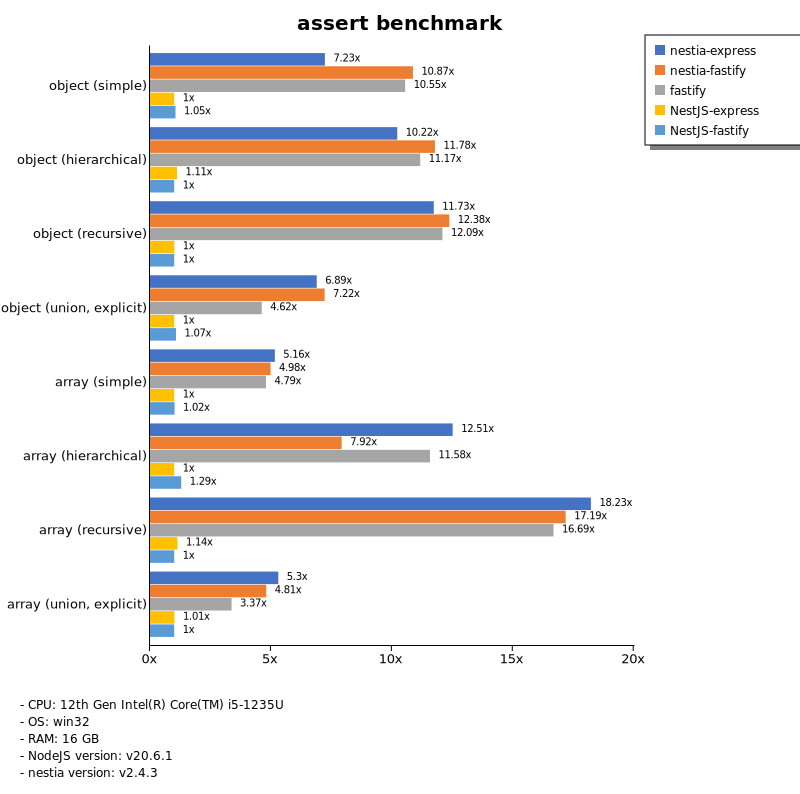
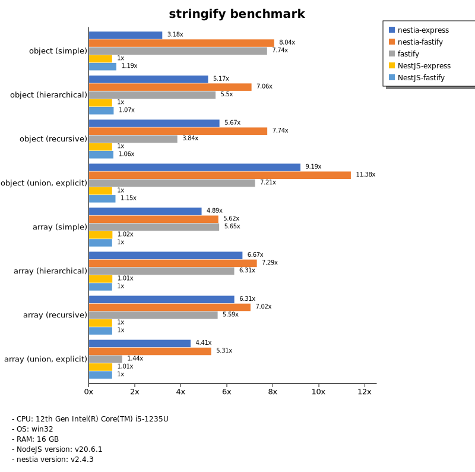
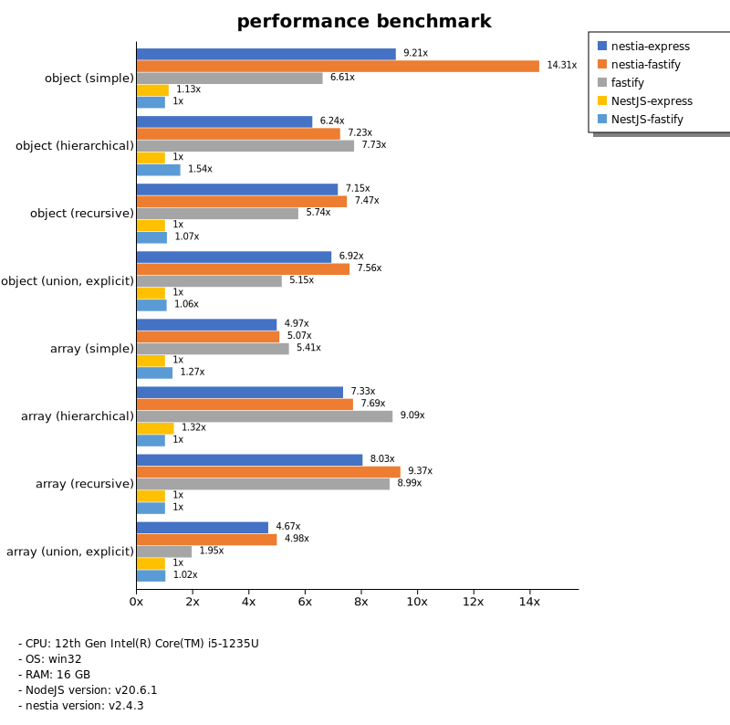

# Benchmark of `nestia`
> - CPU: 12th Gen Intel(R) Core(TM) i5-1235U
> - Memory: 16,208 MB
> - OS: win32
> - NodeJS version: v20.6.1
> - nestia version: v2.4.3

## assert

 Types | nestia-express | nestia-fastify | fastify | NestJS-express | NestJS-fastify 
-------|------|------|------|------|------
 object (simple) | 17 | 26 | 25 | 2.41 | 2.54 
 object (hierarchical) | 43 | 49 | 46 | 4.64 | 4.16 
 object (recursive) | 45 | 48 | 47 | 3.89 | 3.87 
 object (union, explicit) | 32 | 34 | 22 | 4.70 | 5.04 
 array (simple) | 51 | 49 | 48 | 9.91 | 10 
 array (hierarchical) | 53 | 34 | 49 | 4.26 | 5.49 
 array (recursive) | 51 | 48 | 47 | 3.17 | 2.79 
 array (union, explicit) | 53 | 48 | 33 | 10 | 9.92 

> Unit: Megabytes/sec

## stringify

 Types | nestia-express | nestia-fastify | fastify | NestJS-express | NestJS-fastify 
-------|------|------|------|------|------
 object (simple) | 15 | 39 | 38 | 4.86 | 5.76 
 object (hierarchical) | 56 | 77 | 60 | 11 | 12 
 object (recursive) | 57 | 78 | 39 | 10 | 11 
 object (union, explicit) | 43 | 53 | 33 | 4.63 | 5.32 
 array (simple) | 49 | 56 | 57 | 10 | 10 
 array (hierarchical) | 61 | 67 | 58 | 9.32 | 9.21 
 array (recursive) | 54 | 60 | 48 | 8.62 | 8.65 
 array (union, explicit) | 50 | 60 | 16 | 11 | 11 

> Unit: Megabytes/sec

## performance

 Types | nestia-express | nestia-fastify | fastify | NestJS-express | NestJS-fastify 
-------|------|------|------|------|------
 object (simple) | 22 | 34 | 16 | 2.70 | 2.39 
 object (hierarchical) | 30 | 35 | 37 | 4.80 | 7.41 
 object (recursive) | 46 | 48 | 37 | 6.46 | 6.90 
 object (union, explicit) | 30 | 33 | 22 | 4.35 | 4.60 
 array (simple) | 40 | 41 | 43 | 8.02 | 10 
 array (hierarchical) | 44 | 46 | 55 | 7.89 | 6.00 
 array (recursive) | 44 | 52 | 50 | 5.54 | 5.55 
 array (union, explicit) | 50 | 54 | 21 | 11 | 11 

> Unit: Megabytes/sec

Total elapsed time: 3,370,594 ms
