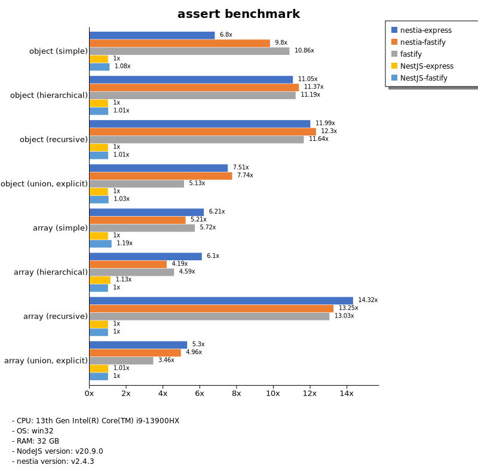
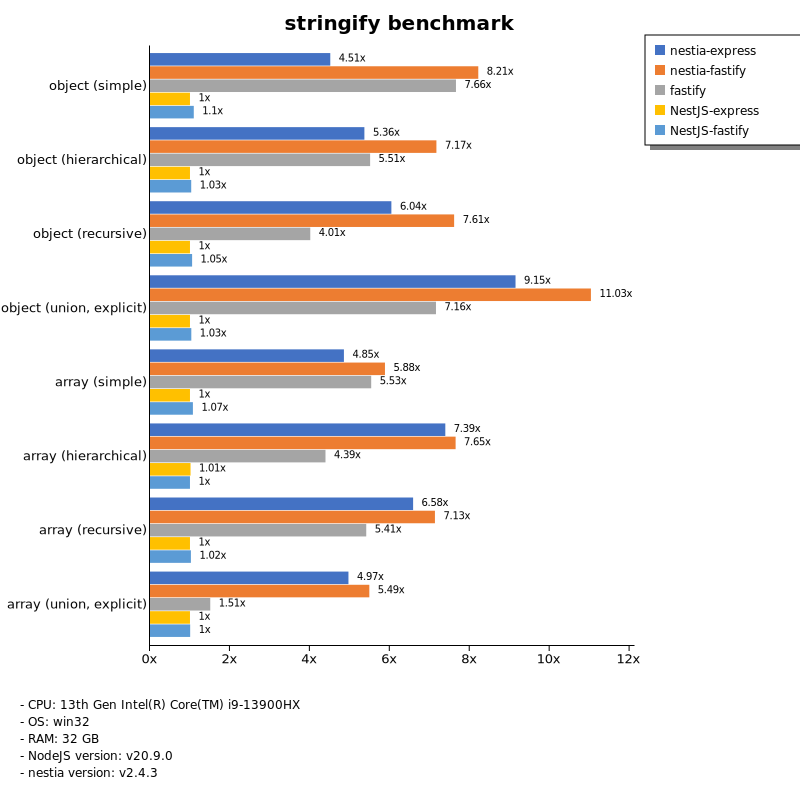
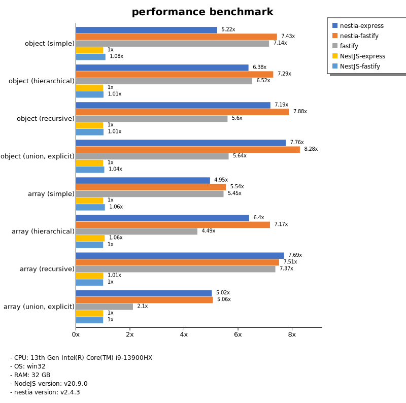

# Benchmark of `nestia`
> - CPU: 13th Gen Intel(R) Core(TM) i9-13900HX
> - Memory: 32,508 MB
> - OS: win32
> - NodeJS version: v20.9.0
> - nestia version: v2.4.3

## assert

 Types | nestia-express | nestia-fastify | fastify | NestJS-express | NestJS-fastify 
-------|------|------|------|------|------
 object (simple) | 51 | 74 | 82 | 7.54 | 8.16 
 object (hierarchical) | 146 | 150 | 148 | 13 | 13 
 object (recursive) | 149 | 153 | 144 | 12 | 12 
 object (union, explicit) | 100 | 103 | 68 | 13 | 14 
 array (simple) | 137 | 115 | 126 | 22 | 26 
 array (hierarchical) | 113 | 78 | 85 | 21 | 19 
 array (recursive) | 144 | 134 | 131 | 10 | 10 
 array (union, explicit) | 161 | 151 | 105 | 31 | 30 

> Unit: Megabytes/sec

## stringify

 Types | nestia-express | nestia-fastify | fastify | NestJS-express | NestJS-fastify 
-------|------|------|------|------|------
 object (simple) | 68 | 124 | 116 | 15 | 17 
 object (hierarchical) | 169 | 226 | 174 | 32 | 33 
 object (recursive) | 174 | 219 | 115 | 29 | 30 
 object (union, explicit) | 133 | 160 | 104 | 15 | 15 
 array (simple) | 143 | 173 | 163 | 29 | 32 
 array (hierarchical) | 187 | 193 | 111 | 26 | 25 
 array (recursive) | 170 | 185 | 140 | 26 | 27 
 array (union, explicit) | 160 | 177 | 49 | 32 | 32 

> Unit: Megabytes/sec

## performance

 Types | nestia-express | nestia-fastify | fastify | NestJS-express | NestJS-fastify 
-------|------|------|------|------|------
 object (simple) | 72 | 103 | 99 | 14 | 15 
 object (hierarchical) | 157 | 179 | 160 | 25 | 25 
 object (recursive) | 165 | 181 | 128 | 23 | 23 
 object (union, explicit) | 106 | 113 | 77 | 14 | 14 
 array (simple) | 136 | 152 | 150 | 28 | 29 
 array (hierarchical) | 143 | 160 | 100 | 24 | 22 
 array (recursive) | 148 | 144 | 141 | 19 | 19 
 array (union, explicit) | 157 | 158 | 66 | 31 | 31 

> Unit: Megabytes/sec

Total elapsed time: 2,199,115 ms
