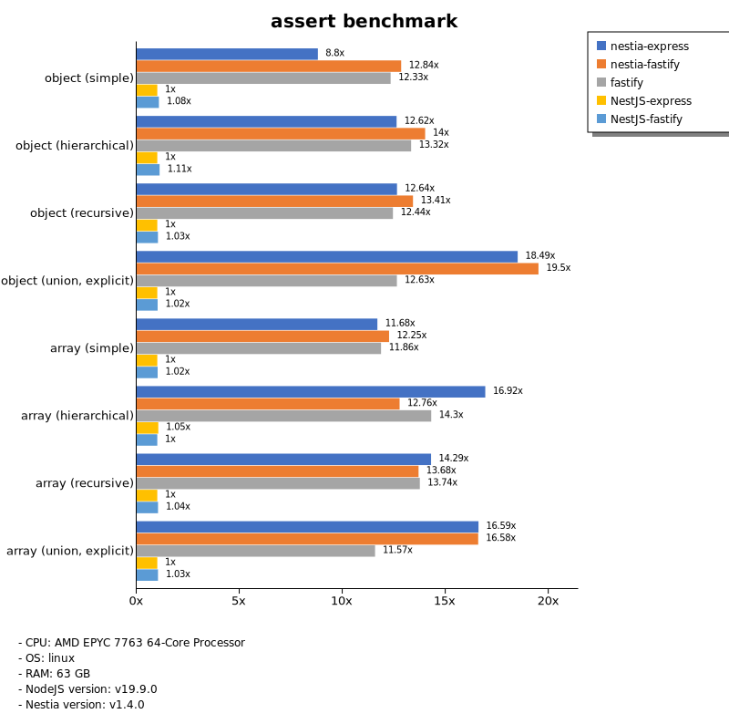
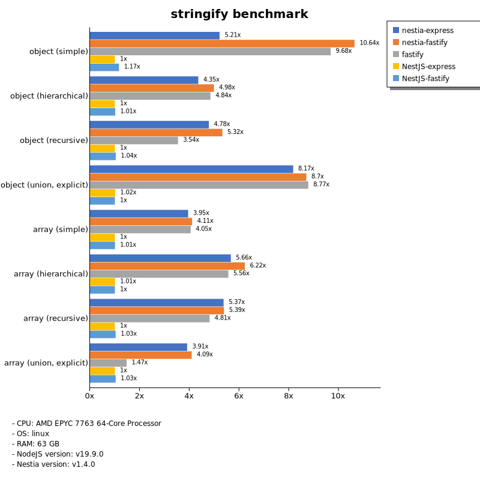
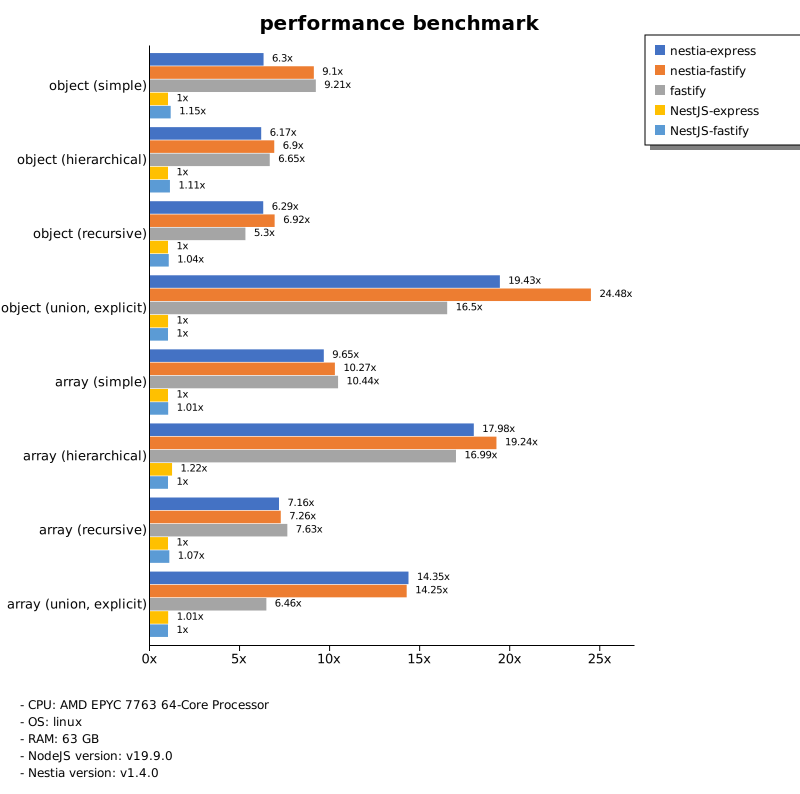

# Benchmark of `nestia`
> - CPU: AMD EPYC 7763 64-Core Processor
> - Memory: 64,301 MB
> - OS: linux
> - NodeJS version: v19.9.0
> - Nestia version: v1.4.0

## assert

 Types | nestia-express | nestia-fastify | fastify | NestJS-express | NestJS-fastify 
-------|------|------|------|------|------
 object (simple) | 39 | 57 | 55 | 4.47 | 4.82 
 object (hierarchical) | 99 | 109 | 104 | 7.82 | 8.69 
 object (recursive) | 95 | 100 | 93 | 7.49 | 7.73 
 object (union, explicit) | 58 | 61 | 39 | 3.12 | 3.17 
 array (simple) | 86 | 90 | 87 | 7.35 | 7.48 
 array (hierarchical) | 82 | 62 | 70 | 5.10 | 4.87 
 array (recursive) | 78 | 74 | 75 | 5.43 | 5.62 
 array (union, explicit) | 92 | 92 | 64 | 5.56 | 5.75 

> Unit: Megabytes/sec

## stringify

 Types | nestia-express | nestia-fastify | fastify | NestJS-express | NestJS-fastify 
-------|------|------|------|------|------
 object (simple) | 49 | 101 | 91 | 9.45 | 11 
 object (hierarchical) | 77 | 88 | 86 | 18 | 18 
 object (recursive) | 78 | 86 | 57 | 16 | 17 
 object (union, explicit) | 70 | 74 | 75 | 8.69 | 8.56 
 array (simple) | 67 | 70 | 69 | 17 | 17 
 array (hierarchical) | 81 | 90 | 80 | 14 | 14 
 array (recursive) | 80 | 80 | 72 | 15 | 15 
 array (union, explicit) | 72 | 75 | 27 | 18 | 19 

> Unit: Megabytes/sec

## performance

 Types | nestia-express | nestia-fastify | fastify | NestJS-express | NestJS-fastify 
-------|------|------|------|------|------
 object (simple) | 52 | 75 | 75 | 8.20 | 9.41 
 object (hierarchical) | 88 | 98 | 95 | 14 | 16 
 object (recursive) | 86 | 95 | 73 | 14 | 14 
 object (union, explicit) | 60 | 76 | 51 | 3.12 | 3.11 
 array (simple) | 70 | 75 | 76 | 7.28 | 7.34 
 array (hierarchical) | 78 | 83 | 74 | 5.32 | 4.34 
 array (recursive) | 74 | 75 | 78 | 10 | 11 
 array (union, explicit) | 78 | 77 | 35 | 5.48 | 5.43 

> Unit: Megabytes/sec

Total elapsed time: 4,316,448 ms
