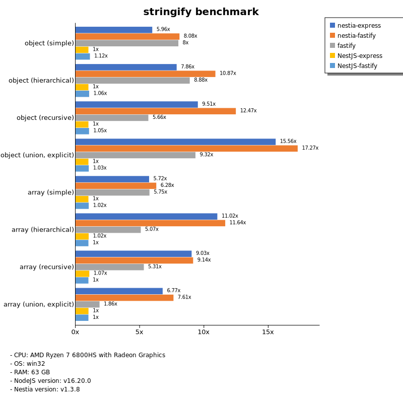

# Benchmark of `nestia`
> - CPU: AMD Ryzen 7 6800HS with Radeon Graphics
> - Memory: 64,780 MB
> - OS: win32
> - NodeJS version: v16.20.0
> - Nestia version: v1.2.2

## stringify

 Types | nestia-express | nestia-fastify | NestJS-express | NestJS-fastify 
-------|------|------|------|------
 object (simple) | 47 | 72 | 8.00 | 8.80 
 object (hierarchical) | 119 | 180 | 17 | 18 
 object (recursive) | 122 | 148 | 15 | 15 
 object (union, explicit) | 85 | 118 | 7.27 | 7.35 
 array (simple) | 97 | 101 | 15 | 16 
 array (hierarchical) | 153 | 146 | 14 | 14 
 array (recursive) | 121 | 125 | 14 | 15 
 array (union, explicit) | 112 | 123 | 17 | 16 

> Unit: Megabytes/sec

Total elapsed time: 370,703 ms
