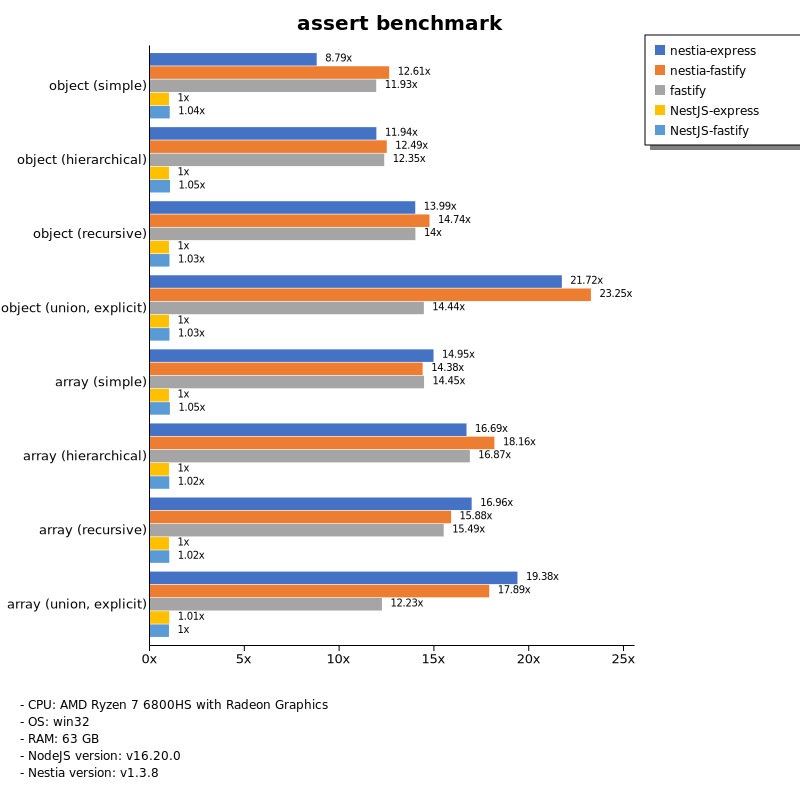
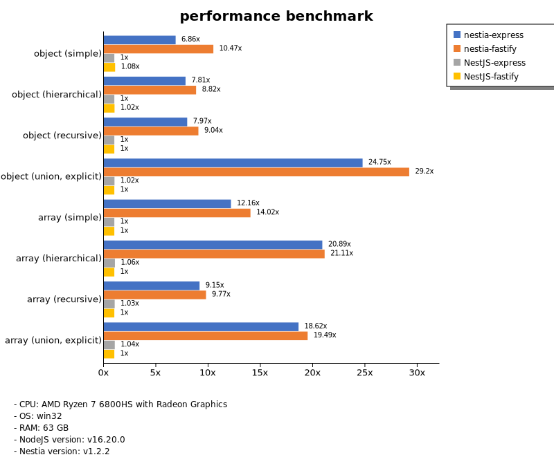

# Benchmark of `nestia`
> - CPU: AMD Ryzen 7 6800HS with Radeon Graphics
> - Memory: 64,780 MB
> - OS: win32
> - NodeJS version: v16.20.0
> - Nestia version: v1.2.2

## assert

 Types | nestia-express | nestia-fastify | NestJS-express | NestJS-fastify 
-------|------|------|------|------
 object (simple) | 32 | 46 | 4.37 | 4.18 
 object (hierarchical) | 91 | 106 | 8.28 | 8.46 
 object (recursive) | 103 | 111 | 7.79 | 7.90 
 object (union, explicit) | 69 | 75 | 3.31 | 3.25 
 array (simple) | 103 | 105 | 7.46 | 7.94 
 array (hierarchical) | 106 | 109 | 6.20 | 6.46 
 array (recursive) | 111 | 106 | 7.00 | 7.12 
 array (union, explicit) | 123 | 112 | 6.45 | 6.36 

> Unit: Megabytes/sec

## stringify

 Types | nestia-express | nestia-fastify | NestJS-express | NestJS-fastify 
-------|------|------|------|------
 object (simple) | 48 | 74 | 8.39 | 9.29 
 object (hierarchical) | 125 | 176 | 17 | 18 
 object (recursive) | 128 | 157 | 14 | 14 
 object (union, explicit) | 81 | 113 | 6.75 | 6.81 
 array (simple) | 75 | 110 | 16 | 16 
 array (hierarchical) | 145 | 158 | 14 | 14 
 array (recursive) | 123 | 127 | 15 | 15 
 array (union, explicit) | 113 | 126 | 17 | 16 

> Unit: Megabytes/sec

## performance

 Types | nestia-express | nestia-fastify | NestJS-express | NestJS-fastify 
-------|------|------|------|------
 object (simple) | 57 | 86 | 8.25 | 8.87 
 object (hierarchical) | 122 | 137 | 16 | 16 
 object (recursive) | 118 | 134 | 15 | 15 
 object (union, explicit) | 80 | 95 | 3.29 | 3.24 
 array (simple) | 95 | 109 | 7.81 | 7.80 
 array (hierarchical) | 124 | 125 | 6.26 | 5.93 
 array (recursive) | 116 | 124 | 13 | 13 
 array (union, explicit) | 121 | 127 | 6.77 | 6.49 

> Unit: Megabytes/sec

Total elapsed time: 1,126,277 ms
