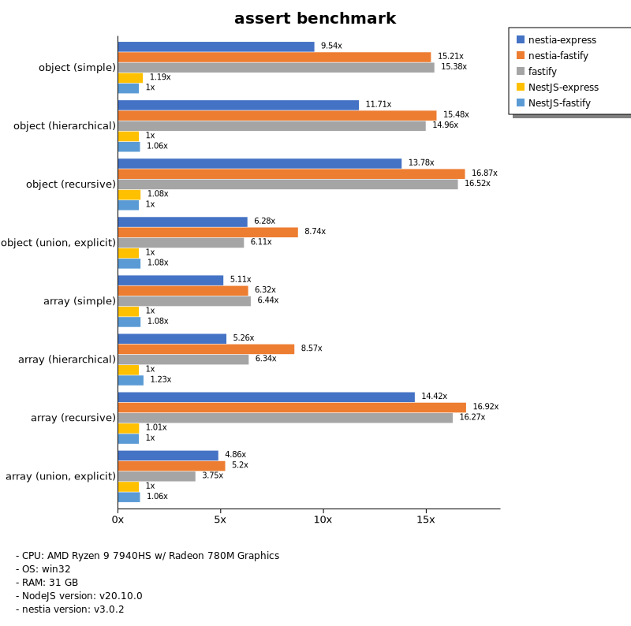
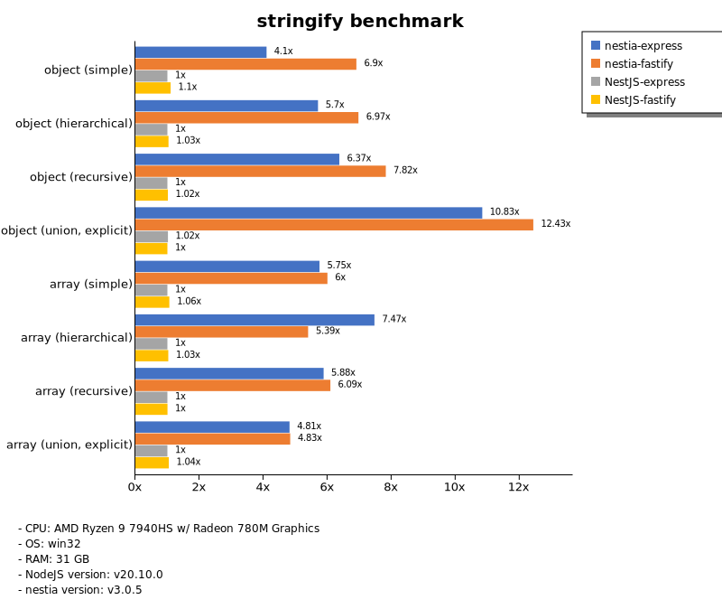
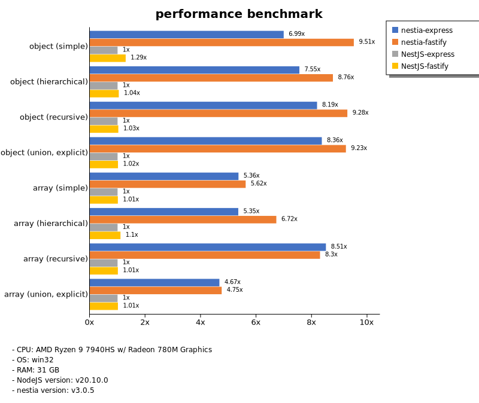

# Benchmark of `nestia`
> - CPU: AMD Ryzen 9 7940HS w/ Radeon 780M Graphics
> - Memory: 31,954 MB
> - OS: win32
> - NodeJS version: v20.10.0
> - nestia version: v2.4.3

## assert

 Types | nestia-express | nestia-fastify | fastify | NestJS-express | NestJS-fastify 
-------|------|------|------|------|------
 object (simple) | 52 | 83 | 82 | 6.32 | 6.89 
 object (hierarchical) | 127 | 160 | 157 | 11 | 11 
 object (recursive) | 130 | 155 | 144 | 10 | 10 
 object (union, explicit) | 78 | 100 | 67 | 11 | 12 
 array (simple) | 127 | 150 | 144 | 24 | 24 
 array (hierarchical) | 101 | 115 | 112 | 18 | 19 
 array (recursive) | 113 | 130 | 128 | 8.22 | 8.33 
 array (union, explicit) | 141 | 153 | 105 | 29 | 29 

> Unit: Megabytes/sec

## stringify

 Types | nestia-express | nestia-fastify | fastify | NestJS-express | NestJS-fastify 
-------|------|------|------|------|------
 object (simple) | 61 | 105 | 93 | 14 | 17 
 object (hierarchical) | 161 | 197 | 162 | 27 | 28 
 object (recursive) | 156 | 192 | 95 | 24 | 22 
 object (union, explicit) | 122 | 140 | 90 | 11 | 11 
 array (simple) | 126 | 141 | 133 | 24 | 26 
 array (hierarchical) | 161 | 155 | 72 | 21 | 23 
 array (recursive) | 127 | 126 | 85 | 22 | 21 
 array (union, explicit) | 131 | 129 | 34 | 28 | 27 

> Unit: Megabytes/sec

## performance

 Types | nestia-express | nestia-fastify | fastify | NestJS-express | NestJS-fastify 
-------|------|------|------|------|------
 object (simple) | 66 | 95 | 93 | 12 | 12 
 object (hierarchical) | 147 | 170 | 154 | 20 | 20 
 object (recursive) | 152 | 169 | 118 | 19 | 19 
 object (union, explicit) | 98 | 108 | 71 | 11 | 12 
 array (simple) | 127 | 138 | 131 | 24 | 24 
 array (hierarchical) | 138 | 122 | 109 | 15 | 20 
 array (recursive) | 128 | 129 | 121 | 15 | 15 
 array (union, explicit) | 139 | 141 | 55 | 28 | 27 

> Unit: Megabytes/sec

Total elapsed time: 2,332,220 ms
