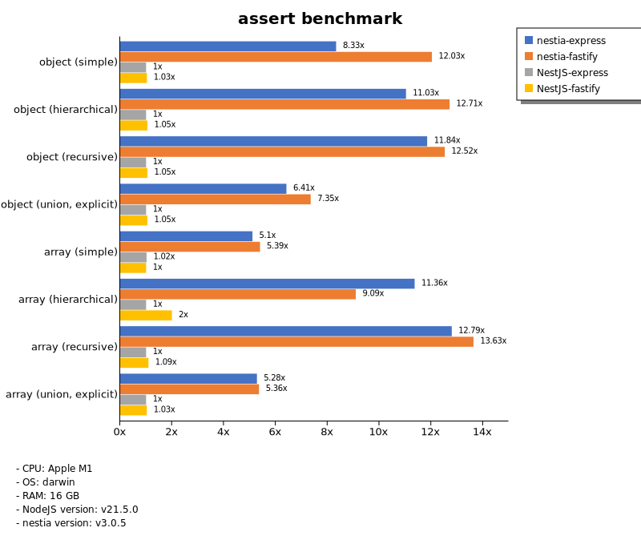
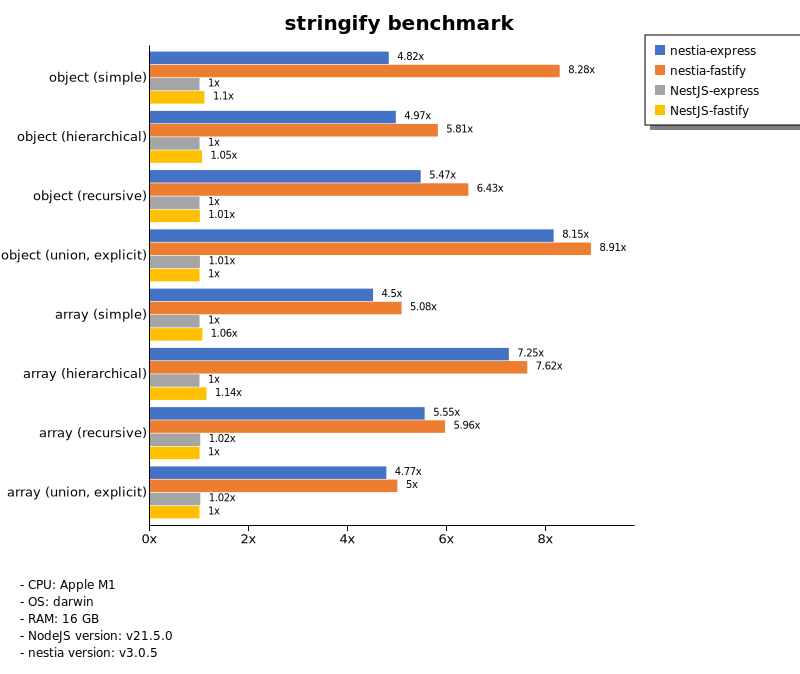
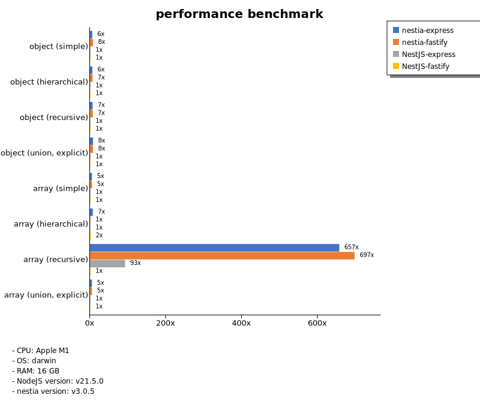

# Benchmark of `nestia`
> - CPU: Apple M1
> - Memory: 16,384 MB
> - OS: darwin
> - NodeJS version: v21.5.0
> - nestia version: v3.0.5

## assert

 Types | nestia-express | nestia-fastify | NestJS-express | NestJS-fastify 
-------|------|------|------|------
 object (simple) | 73 | 105 | 8.72 | 9.00 
 object (hierarchical) | 159 | 183 | 14 | 15 
 object (recursive) | 151 | 159 | 13 | 13 
 object (union, explicit) | 90 | 103 | 14 | 15 
 array (simple) | 139 | 147 | 28 | 27 
 array (hierarchical) | 102 | 82 | 9.00 | 18 
 array (recursive) | 130 | 139 | 10 | 11 
 array (union, explicit) | 158 | 161 | 30 | 31 

> Unit: Megabytes/sec

## stringify

 Types | nestia-express | nestia-fastify | NestJS-express | NestJS-fastify 
-------|------|------|------|------
 object (simple) | 89 | 152 | 18 | 20 
 object (hierarchical) | 173 | 203 | 35 | 37 
 object (recursive) | 170 | 200 | 31 | 31 
 object (union, explicit) | 136 | 148 | 17 | 17 
 array (simple) | 142 | 161 | 32 | 33 
 array (hierarchical) | 166 | 174 | 23 | 26 
 array (recursive) | 155 | 166 | 28 | 28 
 array (union, explicit) | 156 | 164 | 33 | 33 

> Unit: Megabytes/sec

## performance

 Types | nestia-express | nestia-fastify | NestJS-express | NestJS-fastify 
-------|------|------|------|------
 object (simple) | 96 | 125 | 16 | 17 
 object (hierarchical) | 168 | 182 | 26 | 27 
 object (recursive) | 165 | 172 | 24 | 24 
 object (union, explicit) | 109 | 110 | 14 | 14 
 array (simple) | 141 | 143 | 27 | 28 
 array (hierarchical) | 110 | 15 | 17 | 24 
 array (recursive) | 134 | 143 | 19 | 0.20 
 array (union, explicit) | 151 | 150 | 30 | 30 

> Unit: Megabytes/sec

Total elapsed time: 1,136,505 ms
