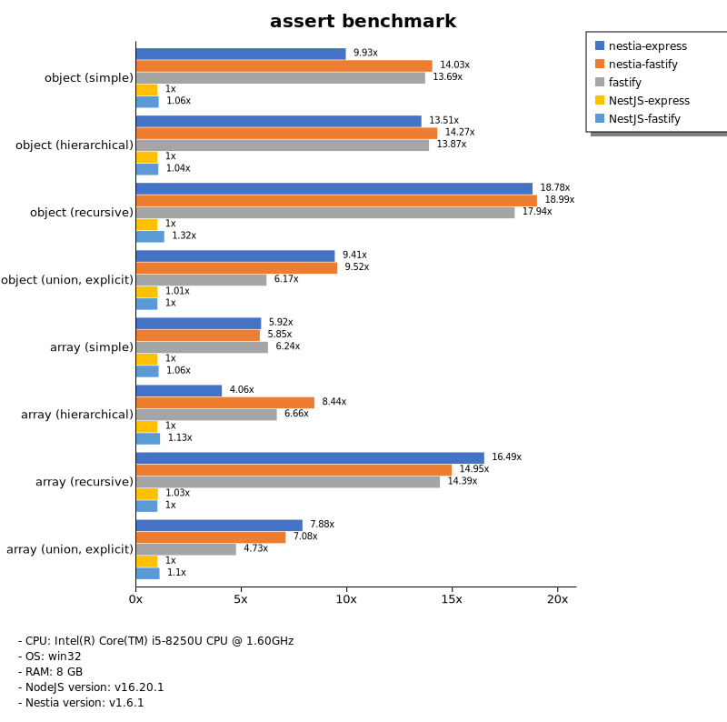
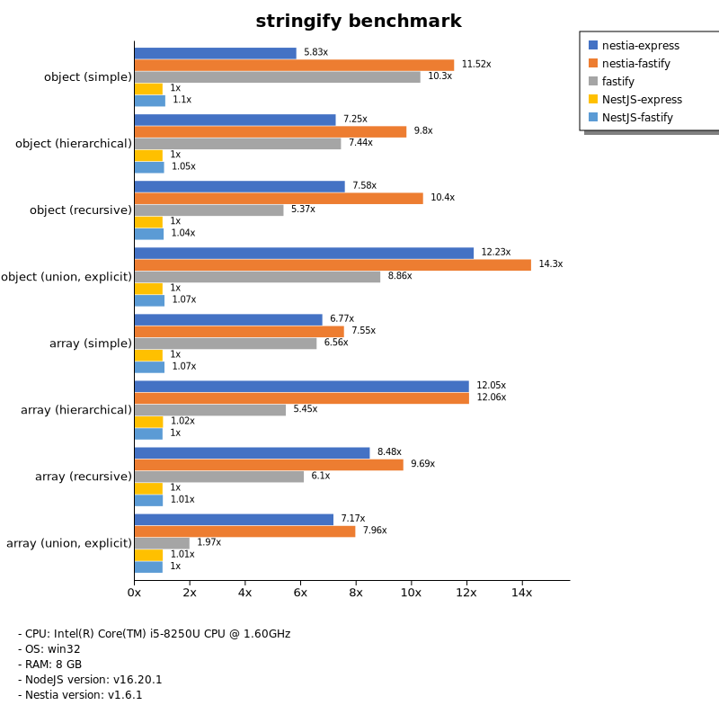
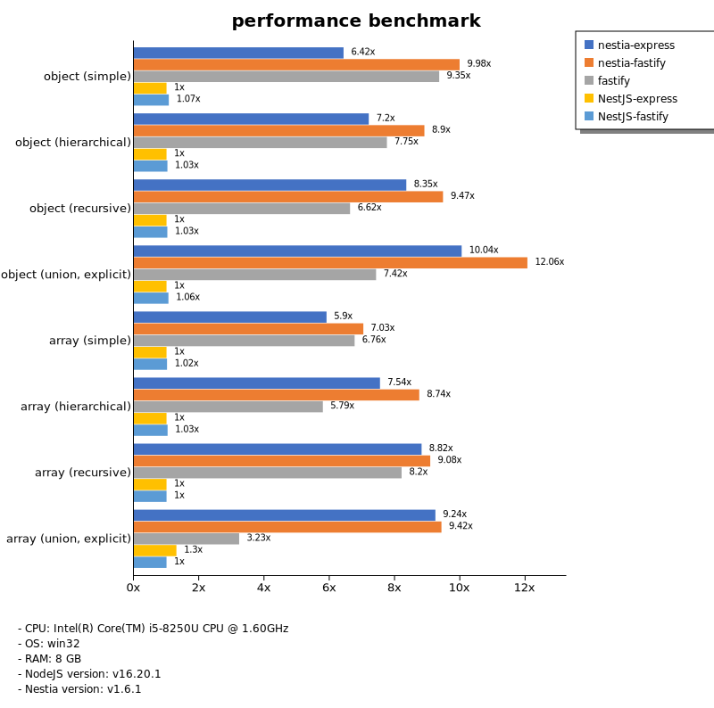

# Benchmark of `nestia`
> - CPU: Intel(R) Core(TM) i5-8250U CPU @ 1.60GHz
> - Memory: 8,109 MB
> - OS: win32
> - NodeJS version: v16.20.1
> - Nestia version: v1.6.1

## assert

 Types | nestia-express | nestia-fastify | fastify | NestJS-express | NestJS-fastify 
-------|------|------|------|------|------
 object (simple) | 30 | 42 | 41 | 3.02 | 3.21 
 object (hierarchical) | 71 | 74 | 72 | 5.22 | 5.45 
 object (recursive) | 69 | 69 | 66 | 3.66 | 4.84 
 object (union, explicit) | 46 | 46 | 30 | 4.90 | 4.84 
 array (simple) | 60 | 59 | 63 | 10 | 11 
 array (hierarchical) | 30 | 63 | 49 | 7.42 | 8.36 
 array (recursive) | 65 | 59 | 56 | 4.02 | 3.92 
 array (union, explicit) | 72 | 65 | 43 | 9.16 | 10 

> Unit: Megabytes/sec

## stringify

 Types | nestia-express | nestia-fastify | fastify | NestJS-express | NestJS-fastify 
-------|------|------|------|------|------
 object (simple) | 33 | 66 | 59 | 5.73 | 6.30 
 object (hierarchical) | 81 | 110 | 83 | 11 | 12 
 object (recursive) | 76 | 104 | 54 | 9.97 | 10 
 object (union, explicit) | 59 | 69 | 43 | 4.84 | 5.19 
 array (simple) | 70 | 78 | 67 | 10 | 11 
 array (hierarchical) | 97 | 97 | 44 | 8.20 | 8.06 
 array (recursive) | 80 | 92 | 58 | 9.47 | 9.57 
 array (union, explicit) | 75 | 84 | 21 | 11 | 10 

> Unit: Megabytes/sec

## performance

 Types | nestia-express | nestia-fastify | fastify | NestJS-express | NestJS-fastify 
-------|------|------|------|------|------
 object (simple) | 35 | 55 | 51 | 5.49 | 5.88 
 object (hierarchical) | 70 | 87 | 75 | 9.73 | 9.99 
 object (recursive) | 74 | 84 | 58 | 8.82 | 9.04 
 object (union, explicit) | 49 | 58 | 36 | 4.85 | 5.14 
 array (simple) | 60 | 71 | 69 | 10 | 10 
 array (hierarchical) | 55 | 64 | 42 | 7.33 | 7.57 
 array (recursive) | 67 | 69 | 63 | 7.65 | 7.65 
 array (union, explicit) | 71 | 72 | 25 | 10 | 7.68 

> Unit: Megabytes/sec

Total elapsed time: 3,102,525 ms
