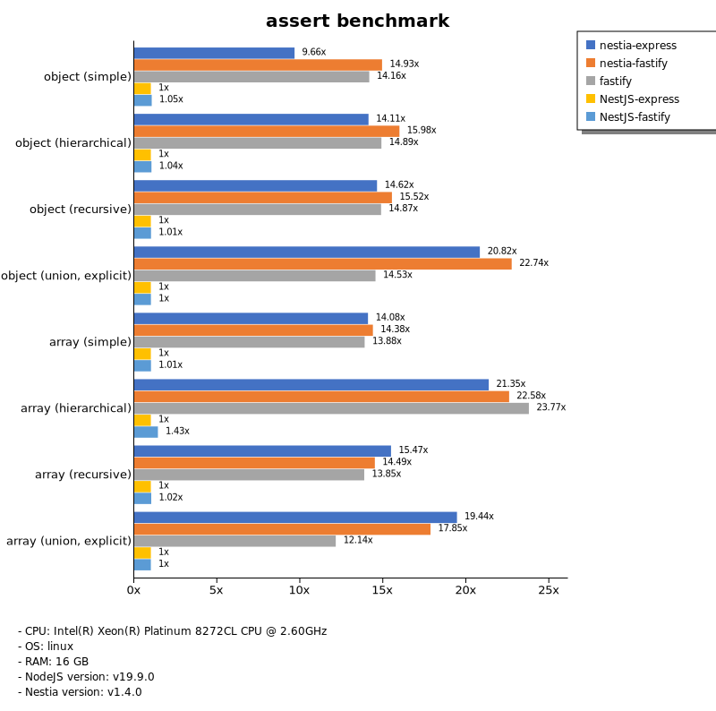
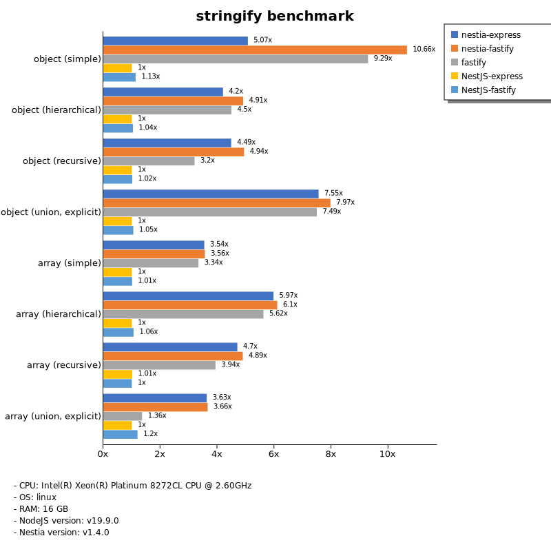
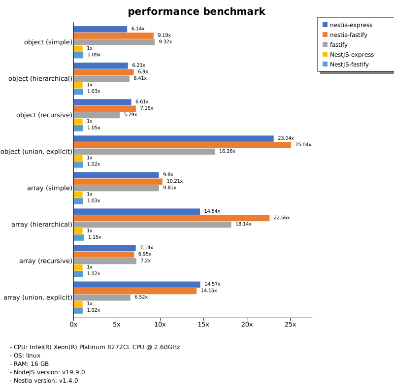

# Benchmark of `nestia`
> - CPU: Intel(R) Xeon(R) Platinum 8272CL CPU @ 2.60GHz
> - Memory: 15,991 MB
> - OS: linux
> - NodeJS version: v19.9.0
> - Nestia version: v1.4.0

## assert

 Types | nestia-express | nestia-fastify | fastify | NestJS-express | NestJS-fastify 
-------|------|------|------|------|------
 object (simple) | 30 | 47 | 44 | 3.14 | 3.30 
 object (hierarchical) | 76 | 86 | 81 | 5.41 | 5.61 
 object (recursive) | 74 | 79 | 75 | 5.07 | 5.12 
 object (union, explicit) | 45 | 49 | 32 | 2.17 | 2.18 
 array (simple) | 70 | 72 | 69 | 4.97 | 5.02 
 array (hierarchical) | 50 | 53 | 56 | 2.34 | 3.34 
 array (recursive) | 61 | 57 | 54 | 3.93 | 4.03 
 array (union, explicit) | 77 | 71 | 48 | 3.97 | 3.96 

> Unit: Megabytes/sec

## stringify

 Types | nestia-express | nestia-fastify | fastify | NestJS-express | NestJS-fastify 
-------|------|------|------|------|------
 object (simple) | 33 | 70 | 61 | 6.61 | 7.49 
 object (hierarchical) | 52 | 61 | 56 | 12 | 13 
 object (recursive) | 52 | 57 | 37 | 12 | 12 
 object (union, explicit) | 47 | 49 | 46 | 6.20 | 6.53 
 array (simple) | 43 | 43 | 41 | 12 | 12 
 array (hierarchical) | 58 | 59 | 54 | 9.68 | 10 
 array (recursive) | 51 | 53 | 42 | 11 | 11 
 array (union, explicit) | 40 | 40 | 15 | 11 | 13 

> Unit: Megabytes/sec

## performance

 Types | nestia-express | nestia-fastify | fastify | NestJS-express | NestJS-fastify 
-------|------|------|------|------|------
 object (simple) | 36 | 54 | 54 | 5.83 | 6.33 
 object (hierarchical) | 64 | 71 | 66 | 10 | 11 
 object (recursive) | 63 | 68 | 50 | 9.45 | 9.90 
 object (union, explicit) | 52 | 56 | 37 | 2.25 | 2.29 
 array (simple) | 51 | 53 | 51 | 5.23 | 5.38 
 array (hierarchical) | 38 | 59 | 48 | 2.62 | 3.00 
 array (recursive) | 53 | 52 | 54 | 7.46 | 7.65 
 array (union, explicit) | 57 | 55 | 25 | 3.89 | 3.95 

> Unit: Megabytes/sec

Total elapsed time: 4,177,790 ms
