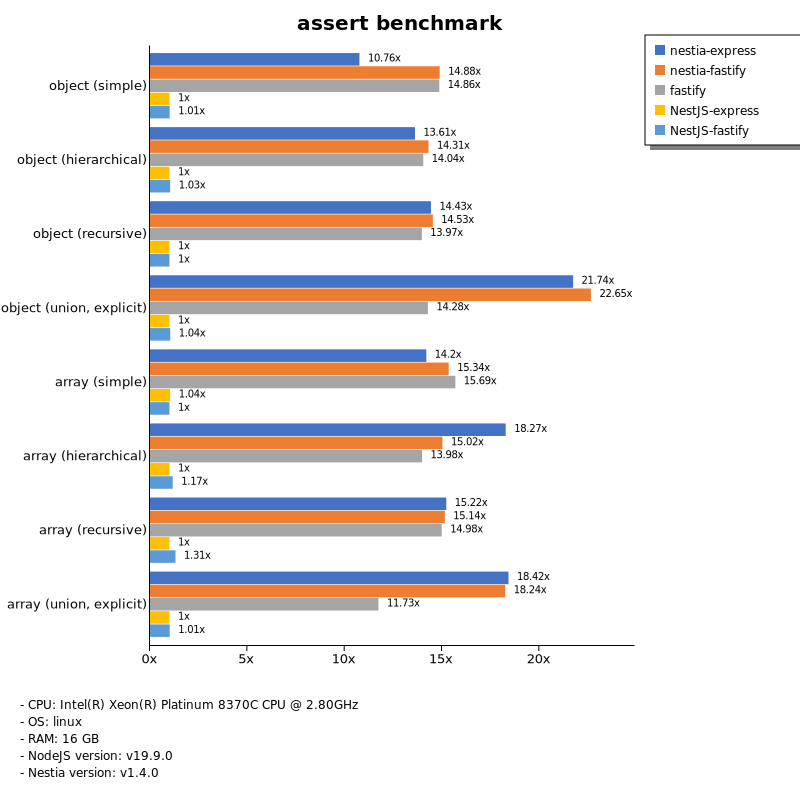
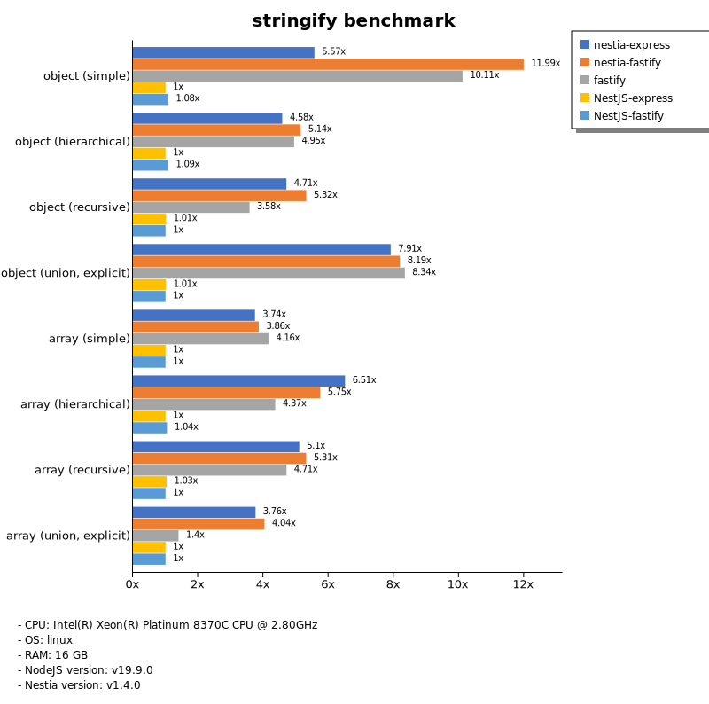
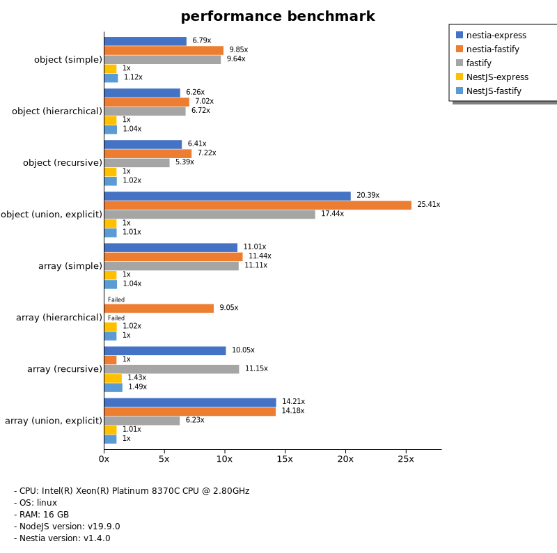

# Benchmark of `nestia`
> - CPU: Intel(R) Xeon(R) Platinum 8370C CPU @ 2.80GHz
> - Memory: 15,991 MB
> - OS: linux
> - NodeJS version: v19.9.0
> - Nestia version: v1.4.0

## assert

 Types | nestia-express | nestia-fastify | fastify | NestJS-express | NestJS-fastify 
-------|------|------|------|------|------
 object (simple) | 38 | 53 | 53 | 3.57 | 3.61 
 object (hierarchical) | 85 | 89 | 87 | 6.22 | 6.43 
 object (recursive) | 85 | 86 | 83 | 5.93 | 5.91 
 object (union, explicit) | 51 | 53 | 33 | 2.35 | 2.44 
 array (simple) | 72 | 77 | 79 | 5.22 | 5.04 
 array (hierarchical) | 60 | 50 | 46 | 3.31 | 3.86 
 array (recursive) | 51 | 51 | 50 | 3.37 | 4.41 
 array (union, explicit) | 79 | 78 | 50 | 4.27 | 4.32 

> Unit: Megabytes/sec

## stringify

 Types | nestia-express | nestia-fastify | fastify | NestJS-express | NestJS-fastify 
-------|------|------|------|------|------
 object (simple) | 42 | 91 | 77 | 7.59 | 8.23 
 object (hierarchical) | 63 | 70 | 68 | 14 | 15 
 object (recursive) | 60 | 68 | 46 | 13 | 13 
 object (union, explicit) | 55 | 57 | 58 | 7.02 | 6.95 
 array (simple) | 51 | 52 | 56 | 14 | 14 
 array (hierarchical) | 73 | 65 | 49 | 11 | 12 
 array (recursive) | 63 | 66 | 58 | 13 | 12 
 array (union, explicit) | 57 | 61 | 21 | 15 | 15 

> Unit: Megabytes/sec

## performance

 Types | nestia-express | nestia-fastify | fastify | NestJS-express | NestJS-fastify 
-------|------|------|------|------|------
 object (simple) | 45 | 65 | 63 | 6.55 | 7.34 
 object (hierarchical) | 71 | 80 | 76 | 11 | 12 
 object (recursive) | 70 | 79 | 59 | 11 | 11 
 object (union, explicit) | 49 | 62 | 42 | 2.43 | 2.45 
 array (simple) | 59 | 61 | 59 | 5.31 | 5.54 
 array (hierarchical) | 0.00 | 33 | 0.00 | 3.70 | 3.64 
 array (recursive) | 54 | 5.34 | 59 | 7.65 | 7.93 
 array (union, explicit) | 62 | 62 | 27 | 4.43 | 4.39 

> Unit: Megabytes/sec

Total elapsed time: 4,861,707 ms
