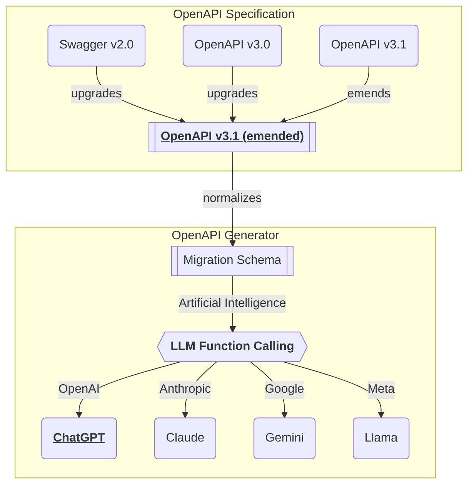

import { Callout, Tabs } from 'nextra/components'
import Carousel from "react-material-ui-carousel"

## Preface
<Carousel cycleNavigation={true} navButtonsAlwaysVisible={true}>
</Carousel>

Chat with your backend server.

You can build a Super A.I. chatbot application from swagger documents performing the LLM function calling.

The super A.I. chatbot selects proper functions defined in the swagger document by analyzing conversation contexts with user. And then the super A.I. chatbot requests the user to write arguments for the selected functions by conversation text, and actually calls the API function with the arguments.

If the swagger file you provide contains a reasonable level of functions, DTO schemas, and descriptions, everything is ready. Just deliver the swagger file to the Nestia A.I. Chatbot, you can start conversation with your backend server calling the API functions by chatting text.

<Callout type="info">
**LLM Function Calling** and **Structured Output**

LLM selects proper function and fill arguments.

In nowadays, most LLM (Large Language Model) like OpenAI are supporting "function calling" feature. The "LLM function calling" means that LLM automatically selects a proper function and fills parameter values from conversation with the user (may by chatting text).

Structured output is another feature of LLM. The "structured output" means that LLM automatically transforms the output conversation into a structured data format like JSON.

- https://platform.openai.com/docs/guides/function-calling
- https://platform.openai.com/docs/guides/structured-outputs
</Callout>


## Demonstration
<iframe src="/videos/shopping.mp4" 
        width="100%" 
        height="600" />

- Shopping A.I. Chatbot: [https://nestia.io/chat/shopping](/chat/shopping)
- Shopping Backend Repository: https://github.com/samchon/shopping-backend
- Swagger Document (`@nestia/editor`): https://shopping-be.wrtn.ai/editor/

The above demonstration video shows Shopping A.I. chatbot built with Nestia.

As you can see, just by delivering only swagger document of the shopping backend server, the shopping A.I. chatbot automatically composed. And in the Shopping A.I. chatbot, the user can search products, and take orders just by conversation text.

No special coding, no special configuration. Just deliver your swagger document.


## Application Setup
<Tabs items={['npm', 'pnpm', 'yarn']}>
  <Tabs.Tab>
```bash filename="Terminal"
npm install @nestia/agent @nestia/chat @samchon/openapi openai
```
  </Tabs.Tab>
  <Tabs.Tab>
```bash filename="Terminal"
pnpm install @nestia/agent @nestia/chat @samchon/openapi openai
```
  </Tabs.Tab>
  <Tabs.Tab>
```bash filename="Terminal"
yarn @nestia/agent @nestia/chat @samchon/openapi openai
```
  </Tabs.Tab>
</Tabs>

Install `@nestia/chat` and its dependencies.

  - `@nestia/chat`
  - `@nestia/agent`
  - `@samchon/openapi`
  - `openai`

To make the super A.I. chatbot, you need to install the above libraries. All of them except `@nestia/chat` are in the dependencies of the `@nestia/chat`, but it would better to install them explicitly for the safe frontend application development.

<Tabs items={['Conceptual Code', 'Actual Code']}>
  <Tabs.Tab>
```typescript filename="src/shopping.tsx" showLineNumbers
import { NestiaAgent } from "@nestia/agent";
import { NestiaChatApplication } from "@nestia/chat";
import {
  HttpLlm,
  IHttpConnection,
  IHttpLlmApplication,
  OpenApi,
} from "@samchon/openapi";
import { OpenAI } from "openai";
import { createRoot } from "react-dom/client";

const main = async (): Promise<void> => {
  // COMPOSE LLM APPLICATION SCHEMA
  const application: IHttpLlmApplication<"chatgpt"> = HttpLlm.application({
    model: "chatgpt",
    document: OpenApi.convert(
      await fetch(
        "https://raw.githubusercontent.com/samchon/shopping-backend/refs/heads/master/packages/api/customer.swagger.json",
      ).then((r) => r.json()),
    ),
  });
  
  // CREATE NESTIA AGENT
  const agent: NestiaAgent = new NestiaAgent({
    provider: {
      type: "chatgpt",
      api: new OpenAI({
        apiKey: "YOUR-OPENAI-API-KEY",
        dangerouslyAllowBrowser: true,
      }),
      model: "gpt-4o-mini",
    },
    controllers: [
      {
        protocol: "http",
        name: "shopping",
        application,
        connection: {
          host: "https://shopping-be.wrtn.ai",
        },
      },
    ],
  });

  // RENDER CHAT APPLICATION
  createRoot(window.document.getElementById("root")!).render(
    <NestiaChatApplication agent={agent} />,
  );
};
main().catch(console.error);
```
  </Tabs.Tab>
  <Tabs.Tab>
```typescript filename="src/shopping.tsx" showLineNumbers
import {
  Button,
  Divider,
  FormControl,
  FormControlLabel,
  Link,
  Radio,
  RadioGroup,
  TextField,
  Typography,
} from "@mui/material";
import { NestiaAgent } from "@nestia/agent";
import {
  HttpLlm,
  IHttpConnection,
  IHttpLlmApplication,
  OpenApi,
} from "@samchon/openapi";
import ShoppingApi from "@samchon/shopping-api";
import OpenAI from "openai";
import { useState } from "react";
import { createRoot } from "react-dom/client";

import { NestiaChatApplication } from "./NestiaChatApplication";

function ShoppingChatApplication() {
  const [apiKey, setApiKey] = useState("");
  const [model, setModel] = useState("gpt-4o-mini");

  const [locale, setLocale] = useState(window.navigator.language);
  const [name, setName] = useState("John Doe");
  const [mobile, setMobile] = useState("821012345678");

  const [agent, setAgent] = useState<NestiaAgent | null>(null);
  const [progress, setProgress] = useState(false);

  const startChatApplication = async () => {
    setProgress(true);
    // PREPARE LLM APPLICATION
    const application: IHttpLlmApplication<"chatgpt"> = HttpLlm.application({
      model: "chatgpt",
      document: OpenApi.convert(
        await fetch(
          "https://raw.githubusercontent.com/samchon/shopping-backend/refs/heads/master/packages/api/customer.swagger.json",
        ).then((r) => r.json()),
      ),
    });

    // HANDLESHAKE WITH SHOPPING BACKEND
    const connection: IHttpConnection = {
      host: "https://shopping-be.wrtn.ai",
    };
    await ShoppingApi.functional.shoppings.customers.authenticate.create(
      connection,
      {
        channel_code: "samchon",
        external_user: null,
        href: window.location.href,
        referrer: window.document.referrer,
      },
    );
    await ShoppingApi.functional.shoppings.customers.authenticate.activate(
      connection,
      {
        mobile,
        name,
      },
    );

    // COMPOSE CHAT AGENT
    setAgent(
      new NestiaAgent({
        provider: {
          type: "chatgpt",
          api: new OpenAI({
            apiKey,
            dangerouslyAllowBrowser: true,
          }),
          model: "gpt-4o-mini",
        },
        controllers: [
          {
            protocol: "http",
            name: "shopping",
            application,
            connection,
          },
        ],
        config: {
          locale,
        },
      }),
    );
  };

  return (
    <div
      style={{
        width: "100%",
        height: "100%",
        overflow: agent ? undefined : "auto",
      }}
    >
      {agent ? (
        <NestiaChatApplication agent={agent} />
      ) : (
        <FormControl
          style={{
            width: "calc(100% - 60px)",
            padding: 15,
            margin: 15,
          }}
        >
          <Typography variant="h4">Shopping A.I. Chatbot</Typography>
          <br />
          <Divider />
          <br />
          Demonstration of Nestia A.I. Chatbot with Shopping Backend API.
          <br />
          <br />
          <Link
            href="https://github.com/samchon/shopping-backend"
            target="_blank"
          >
            https://github.com/samchon/shopping-backend
          </Link>
          <br />
          <br />
          <Typography variant="h6"> OpenAI Configuration </Typography>
          <TextField
            onChange={(e) => setApiKey(e.target.value)}
            defaultValue={apiKey}
            label="OpenAI API Key"
            variant="outlined"
            placeholder="Your OpenAI API Key"
            error={apiKey.length === 0}
          />
          <br />
          <RadioGroup
            defaultValue={model}
            onChange={(_e, value) => setModel(value)}
            style={{ paddingLeft: 15 }}
          >
            <FormControlLabel
              control={<Radio />}
              label="GPT-4o Mini"
              value="gpt-4o-mini"
            />
            <FormControlLabel
              control={<Radio />}
              label="GPT-4o"
              value="gpt-4o"
            />
          </RadioGroup>
          <br />
          <Typography variant="h6"> Membership Information </Typography>
          <br />
          <TextField
            onChange={(e) => setLocale(e.target.value)}
            defaultValue={locale}
            label="Locale"
            variant="outlined"
            error={locale.length === 0}
          />
          <br />
          <TextField
            onChange={(e) => setName(e.target.value)}
            defaultValue={name}
            label="Name"
            variant="outlined"
            error={name.length === 0}
          />
          <br />
          <TextField
            onChange={(e) => setMobile(e.target.value)}
            defaultValue={mobile}
            label="Mobile"
            variant="outlined"
            error={mobile.length === 0}
          />
          <br />
          <br />
          <Button
            component="a"
            fullWidth
            variant="contained"
            color={"info"}
            size="large"
            disabled={
              progress ||
              apiKey.length === 0 ||
              locale.length === 0 ||
              name.length === 0 ||
              mobile.length === 0
            }
            onClick={() => startChatApplication()}
          >
            {progress ? "Starting..." : "Start A.I. Chatbot"}
          </Button>
        </FormControl>
      )}
    </div>
  );
}

const main = async (): Promise<void> => {
  createRoot(window.document.getElementById("root")!).render(
    <ShoppingChatApplication />,
  );
};
main().catch(console.error);
```
  </Tabs.Tab>
</Tabs>

After setup, import and compose the A.I. chatbot like above.

The first thing you should do is composing `OpenApi.IDocument` typed object from your swagger document. The `OpenApi.IDocument` is an emended version of the OpenAPI v3.1 specification for the normalization. You can do it through `OpenApi.convert()` function.

After that, you have to compose the `IHttpLlmApplication` typed object from the `HttpLlm.application()` function. The `IHttpLlmApplication` object is a schema for the LLM function calling. As current Nestia supports only the OpenAI (The type name is chatgpt to avoid confusion due to the similar names `openapi`/`openai`), you should set the `model` property to `"chatgpt"`.

At last, create an `NestiaAgent` instance. The `IHttpLlmApplication` is a type of controller to the `NestiaAgent`, and OpenAI client is a type of provider in the `NestiaAgent` concept. After composing the `NestiaAgent`, you can directly create the A.I. chatbot frontend application with the `<NestiaChatApplication agent={agent} />` statement.

<Callout type="info">
**OpenAPI conversion process**

You can learn more about the schema conversion process in the [`@samchon/openapi`](https://github.com/samchon/openapi) repository. 


</Callout>


## Agent Library
```bash filename="Terminal"
npm install @nestia/agent
```