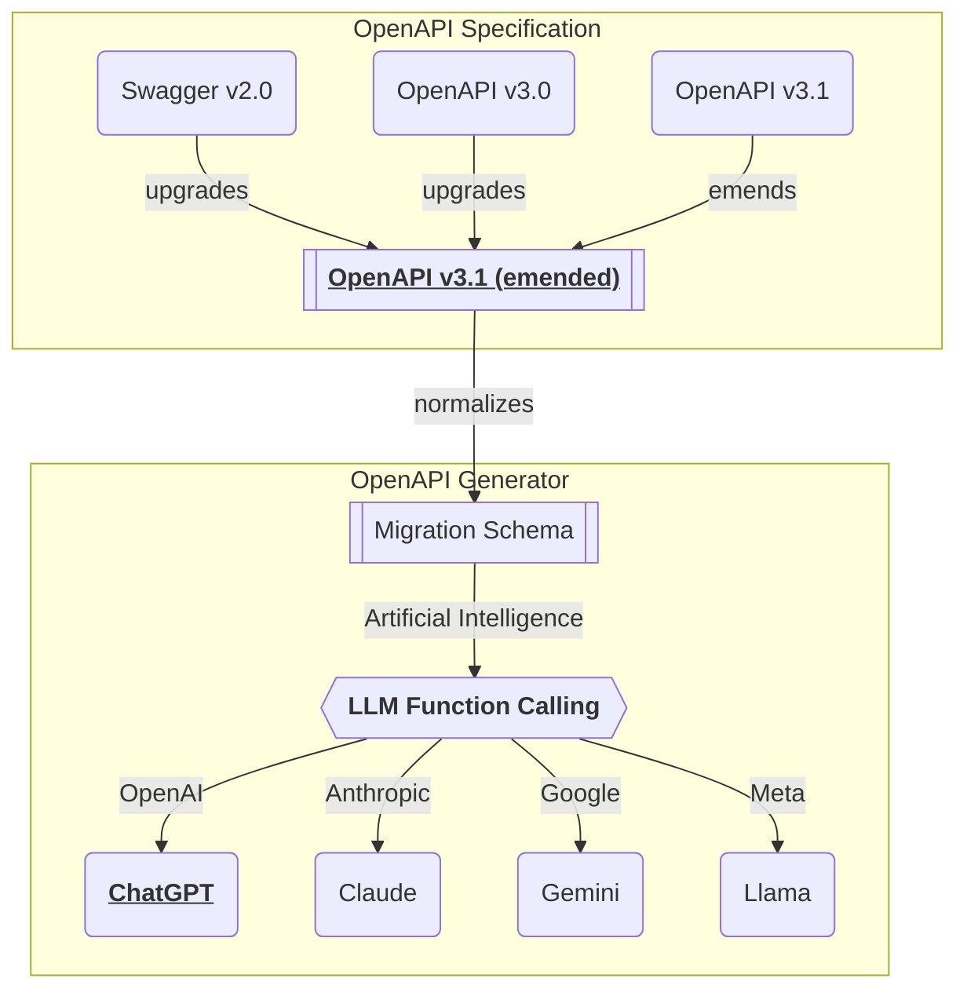

import { Callout, Tabs } from 'nextra/components'

## Super A.I. Chatbot
<br/>
<iframe src="https://www.youtube.com/embed/m47p4iJ90Ms?si=cvgfckN25GJhjLTB" 
        title="Shopping A.I. Chatbot built with Nestia" 
        width="100%" 
        height="600" 
        frameborder="0" 
        allow="accelerometer; autoplay; clipboard-write; encrypted-media; gyroscope; picture-in-picture; web-share" referrerpolicy="strict-origin-when-cross-origin" 
        allowfullscreen></iframe>

  - Shopping A.I. Chatbot Application: [https://nestia.io/chat/shopping](/chat/shopping)
  - Shopping Backend Repository: https://github.com/samchon/shopping-backend
  - Shopping Swagger Document (`@nestia/editor`): [https://nestia.io/editor/?url=...](https://nestia.io/editor/?simulate=true&e2e=true&url=https%3A%2F%2Fraw.githubusercontent.com%2Fsamchon%2Fshopping-backend%2Frefs%2Fheads%2Fmaster%2Fpackages%2Fapi%2Fswagger.json)

The above demonstration video shows Shopping A.I. chatbot built with Nestia.

As you can see, in the Shopping A.I. chatbot application, the user can do everything written in the Swagger documents just by conversation texts. Searching products, taking orders, checking delivery status, user can do these things by chatting texts.

Just by delivering the Swagger document, Super A.I. chatbot performing the LLM (Large Language Model) function calling is automatically composed. The Super A.I. chatbot will select proper functions defined in the Swagger document by analyzing conversation contexts with the user. And then Super A.I. chatbot requests the user to write arguments for the selected functions by conversation texts, and actually calls the API function with the argument. This is the key concept of the Nestia A.I. chatbot.

In other words, every backend servers providing Swagger documents can be conversed to the A.I. chatbot. In the new A.I. era, no more need to dedicate GUI (Graphical User Interface) application development like before. Prepare Swagger document, and let the A.I. chatbot to do the rest. Even though the A.I. chatbot can't conquer every frontend developments, it can replace many things, and more efficient and user-friendly than the traditional GUI applications.


## Playground
[](/chat/playground)

You can test your backend server's A.I. chatbot with the following playground.

Upload your Swagger document file to the [playground website](https://nestia.io/chat/playground), and start conversation with your backend server. If your backend server's documentation is well written so that the A.I. chatbot quality is satisfiable, you can start your own A.I. chatbot service from the next section [#Application Setup](#application-setup).


## Application Setup
<Tabs items={['npm', 'pnpm', 'yarn']}>
  <Tabs.Tab>
```bash filename="Terminal"
npm install @nestia/agent @nestia/chat @samchon/openapi openai
```
  </Tabs.Tab>
  <Tabs.Tab>
```bash filename="Terminal"
pnpm install @nestia/agent @nestia/chat @samchon/openapi openai
```
  </Tabs.Tab>
  <Tabs.Tab>
```bash filename="Terminal"
yarn add @nestia/agent @nestia/chat @samchon/openapi openai
```
  </Tabs.Tab>
</Tabs>

Install `@nestia/chat` and its dependencies.

  - `@nestia/chat`
  - `@nestia/agent`
  - `@samchon/openapi`
  - `openai`

To make the Super A.I. chatbot, you need to install the above libraries. All of them except `@nestia/chat` are in the dependencies of the `@nestia/chat`, but it would better to install them explicitly for the safe frontend application development.

```typescript filename="src/ShoppingChatApplication.tsx" showLineNumbers {20-27, 59}
import { NestiaAgent } from "@nestia/agent";
  import { NestiaChatApplication } from "@nestia/chat";
import {
  HttpLlm,
  IHttpConnection,
  IHttpLlmApplication,
  OpenApi,
} from "@samchon/openapi";
import OpenAI from "openai";
import { useEffect, useState } from "react";

export const ShoppingChatApplication = (
  props: ShoppingChatApplication.IProps,
) => {
  const [application, setApplication] =
    useState<IHttpLlmApplication<"chatgpt"> | null>(null);
  useEffect(() => {
    (async () => {
      setApplication(
        HttpLlm.application({
          model: "chatgpt",
          document: OpenApi.convert(
            await fetch(
              "https://raw.githubusercontent.com/samchon/shopping-backend/refs/heads/master/packages/api/customer.swagger.json",
            ).then((r) => r.json()),
          ),
        }),
      );
    })().catch(console.error);
  }, []);
  if (application === null)
    return (
      <div>
        <h2>Loading Swagger document</h2>
        <hr />
        <p>Wait for a moment please.</p>
        <p>Loading Swagger document...</p>
      </div>
    );

  const agent: NestiaAgent = new NestiaAgent({
    provider: {
      type: "chatgpt",
      api: props.api,
      model: "gpt-4o-mini",
    },
    controllers: [
      {
        protocol: "http",
        name: "main",
        application,
        connection: props.connection,
      },
    ],
    config: {
      locale: props.locale,
    },
  });
  return <NestiaChatApplication agent={agent} />;
};
export namespace ShoppingChatApplication {
  export interface IProps {
    api: OpenAI;
    connection: IHttpConnection;
    name: string;
    mobile: string;
    locale?: string;
  }
}
```

After setup, import and compose the A.I. chatbot like above.

The first thing you should do is composing `OpenApi.IDocument` typed object from your swagger document. The `OpenApi.IDocument` is an emended version of the OpenAPI v3.1 specification for the normalization. You can do it through `OpenApi.convert()` function.

After that, you have to compose the `IHttpLlmApplication` typed object from the `HttpLlm.application()` function. The `IHttpLlmApplication` object is a schema for the LLM function calling. As current Nestia supports only the OpenAI (The type name is chatgpt to avoid confusion due to the similar names `openapi`/`openai`), you should set the `model` property to `"chatgpt"`.

At last, create an `NestiaAgent` instance. The `IHttpLlmApplication` is a type of controller to the `NestiaAgent`, and OpenAI client is a type of provider in the `NestiaAgent` concept. After composing the `NestiaAgent`, you can directly create the A.I. chatbot frontend application with the `<NestiaChatApplication agent={agent} />` statement.

<Callout type="info">
**OpenAPI conversion process**

You can learn more about the schema conversion process in the [`@samchon/openapi`](https://github.com/samchon/openapi) repository. 


</Callout>


## Make Your A.I. Chatbot
Above `@nestia/agent` and `@nestia/chat` libraries are just for testing and demonstration. I've made them to prove a conncept that every backend servers providing swagger documents can be conversed with the A.I. chatbot, and `nestia` is especially efficient for the A.I. chatbot development purpose.

However, `@nestia/agent` support only OpenAI, and has not optimized for specific purpose. As it has not been optimized without any RAG (Retrieval Augmented Generation) models, it may consume a lot of LLM cost than what you may expected. Therefore, use the `@nestia/agent` for studying the A.I. chatbot development, or just demonstrating your backend server before production development.

  - Source Codes:
    - `@nestia/agent`: https://github.com/samchon/nestia/tree/master/packages/agent
    - `@nestia/chat`: https://github.com/samchon/nestia/tree/master/packages/chat


## Wrtn OS
[](https://wrtnlabs.io)

> https://wrtnlabs.io

The new era of software development.

If you are not familiar with LLM (Large Language Model) development or RAG implementation, you can take another option. Prepare your swagger document file, and visit WrtnLabs homepage https://wrtnlabs.io. You can create your own A.I. chatbot with "Wrtn OS", and re-distribute it as you want. The A.I. assistant in the Wrtn OS is much more optimized and cost efficient than the `@nestia/agent`, and it is fully open sourced.

Also, you can sell your swagger document (backend API functions) in the "Wrtn Store", so that let other users to create their own A.I. chatbot with your backend API functions. Conversely, you can purchase the functions you need to create an A.I. chatbot from the store. If you have create an A.I. chatbot with only the functions purchased in the Wrtn Store, it is the no coding development.

I think this is a new way of software development, and a new way of software distribution. It is a new era of software development, and I hope you to be a part of it.
